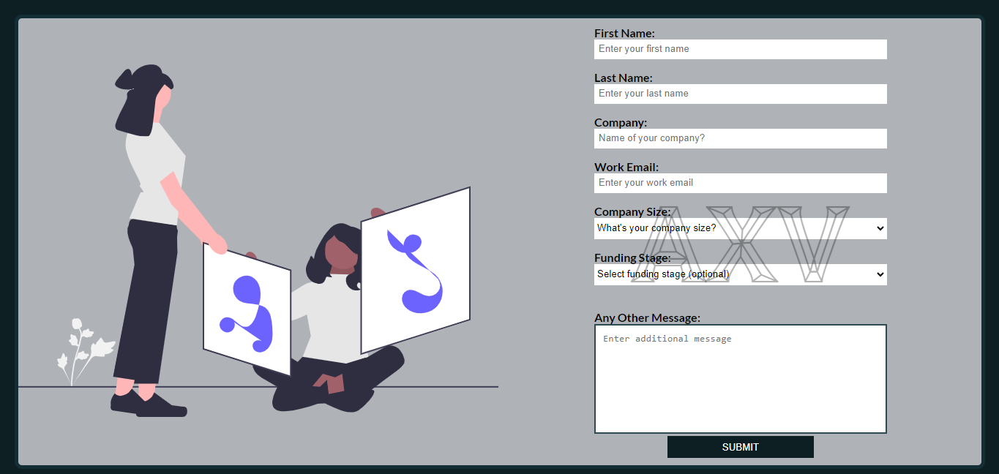

# Design Agency Form.

This is a simple web application that demonstrates how to create a business form with validation and a popup message using HTML, CSS, and JavaScript. A design agency wants to collect more information about businesses that they have or have not worked with, understanding where they(the agency) are and also see how they can improve thieir experience.

## Features

- Collects user information for a business form.
- Validates form input using HTML5 attributes (required, email).
- Shows a popup message when the form is successfully submitted.
- Submits the form data to a server using the Fetch API.
- Demonstrates usage of modern JavaScript features for form handling.

## Sample Screenshot

## Technologies Used

- HTML
- CSS
- JavaScript (ES6)
- Fetch API for HTTP requests

## Acknowledgments

- This project was created for educational purposes to showcase form handling and popup messages in web applications.
- The popup message and form design are inspired by common UI patterns.
